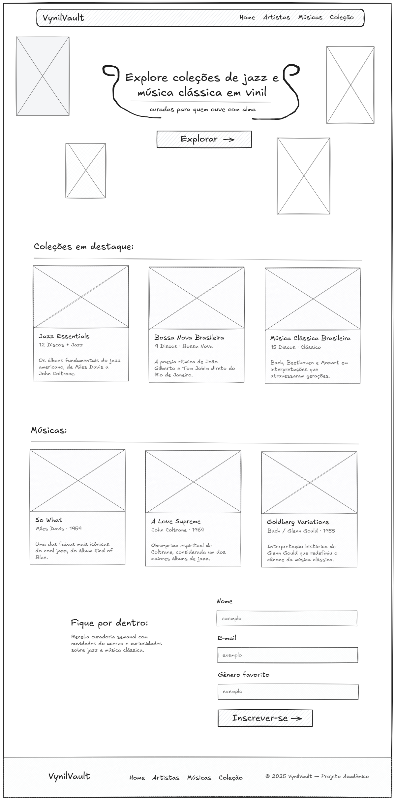

# Trabalho Prático - Semanas 3 e 4

## Informações Gerais
- Nome: Arthur Estevão
- Matricula: 909320
- Proposta escolhida: 4 — Coleções e Itens
- Descrição: Catálogo de discos de vinil de jazz e música clássica.
  O usuário pode explorar coleções temáticas e discos em destaque
  além de visualizar trabalhos de artistas de jazz e música clássica,
  e se inscrever em uma newsletter para receber curadoria semanal.

## Print da tela do wireframe

## Print da tela do homepage

